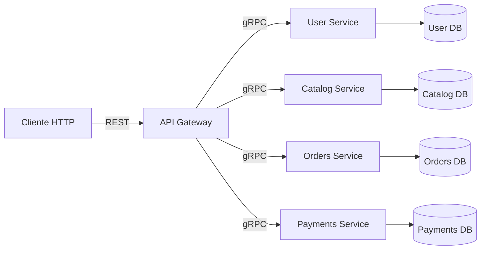

# Proyecto-Sistemas-Distribuidos

FoodRush es una plataforma de pedidos para restaurantes y comercios de comida que separa usuarios, catálogo, pedidos y pagos en servicios independientes. El sistema está pensado para clientes que necesitan consultar comercios y productos, crear pedidos y procesar pagos a través de una única entrada HTTP, mientras la lógica interna se coordina por gRPC.

## Arquitectura



## Levantar con Docker Compose

1. Copia el archivo de ejemplo a `.env`:

```bash
cp .env.example .env
```

2. Levanta los servicios:

```bash
docker compose up --build
```

## Servicios

- `user-service`: gestiona alta y consulta de usuarios.
- `catalog-service`: expone comercios, menus y productos.
- `orders-service`: crea y consulta pedidos.
- `payments-service`: procesa y consulta pagos.
- `api-gateway`: unico punto de entrada HTTP/REST; traduce a gRPC hacia los servicios internos.

## Red interna

Los servicios internos no se publican al host. Solo el `api-gateway` expone un puerto externo.

## Acoplamiento

Cada servicio usa su propia base de datos y su propio contrato gRPC. No se comparten tablas, ni structs internos, ni acceso directo entre bases.

## Justificacion de limites

- `user-service` existe para concentrar identidad y perfil de usuario.
- `catalog-service` existe para aislar el dominio de comercios y productos.
- `orders-service` existe para manejar el ciclo de vida de pedidos sin mezclar persistencia de catálogos o pagos.
- `payments-service` existe para encapsular el flujo de cobros y su estado.
- `api-gateway` existe para separar la entrada HTTP pública de los contratos gRPC internos.

## Probar API Gateway

1. Levanta el stack:

```bash
docker compose up --build
```

2. Verifica salud:

```bash
curl http://localhost:8080/healthz
```

3. Prueba un endpoint:

```bash
curl http://localhost:8080/catalog/comercios
```

4. Ejemplos adicionales:

```bash
curl -X POST http://localhost:8080/users \
  -H 'Content-Type: application/json' \
  -d '{"nombre":"Ana","correo":"ana@mail.com","password":"123456","payment_token":"tok_123"}'
```

```bash
curl -X POST http://localhost:8080/payments/process \
  -H 'Content-Type: application/json' \
  -d '{"order_id":"order-1","user_id":"user-1","amount":1000,"metodo_pago_token":"tok_123"}'
```

## Endpoints del Gateway

- `GET /healthz`
- `GET /`
- `POST /users`
- `GET /users/{id}`
- `GET /catalog/comercios`
- `GET /catalog/comercios/{id}/menu`
- `GET /catalog/products/{id}`
- `POST /orders`
- `GET /orders/{id}`
- `POST /orders/pickup/confirm`
- `POST /payments/process`
- `GET /payments/order/{order_id}`

## Curl por endpoint

```bash
curl http://localhost:8080/
```

```bash
curl http://localhost:8080/healthz
```

```bash
curl -X POST http://localhost:8080/users \
  -H 'Content-Type: application/json' \
  -d '{"nombre":"Ana","correo":"ana@mail.com","password":"123456","payment_token":"tok_123"}'
```

```bash
curl http://localhost:8080/users/USER_ID
```

```bash
curl http://localhost:8080/catalog/comercios
```

```bash
curl "http://localhost:8080/catalog/comercios/COMERCIO_ID/menu"
```

```bash
curl http://localhost:8080/catalog/products/PRODUCT_ID
```

```bash
curl -X POST http://localhost:8080/orders \
  -H 'Content-Type: application/json' \
  -d '{"user_id":"USER_ID","comercio_id":"COMERCIO_ID","items":[{"producto_id":"PRODUCT_ID","cantidad":2}]}'
```

```bash
curl http://localhost:8080/orders/ORDER_ID
```

```bash
curl -X POST http://localhost:8080/orders/pickup/confirm \
  -H 'Content-Type: application/json' \
  -d '{"qr_retiro":"QR_CODE"}'
```

```bash
curl -X POST http://localhost:8080/payments/process \
  -H 'Content-Type: application/json' \
  -d '{"order_id":"ORDER_ID","user_id":"USER_ID","amount":1000,"metodo_pago_token":"tok_123"}'
```

```bash
curl http://localhost:8080/payments/order/ORDER_ID
```

## Use Cases y flujos

### 1. Registrar usuario

El cliente envía `POST /users` con nombre, correo, contraseña y token de pago. El gateway traduce la solicitud a `CreateUser` en `user-service`, que valida los datos y persiste el usuario en PostgreSQL. El resultado esperado es un usuario creado con `id` y estado `created`.

Flujo técnico:
- Cliente -> API Gateway por HTTP/REST
- API Gateway -> User Service por gRPC
- User Service -> PostgreSQL propio
- Respuesta vuelve al cliente como JSON

### 2. Consultar catálogo

El cliente consulta `GET /catalog/comercios`, `GET /catalog/comercios/{id}/menu` o `GET /catalog/products/{id}`. El gateway llama al `catalog-service`, que lee comercios y productos desde su PostgreSQL. El resultado esperado es la lista de comercios, el menú de un comercio o el detalle de un producto.

Flujo técnico:
- Cliente -> API Gateway
- API Gateway -> Catalog Service por gRPC
- Catalog Service -> PostgreSQL de catálogo
- Respuesta JSON al cliente

### 3. Crear pedido

El cliente envía `POST /orders` con usuario, comercio e items. El gateway invoca `CreateOrder` en `orders-service`, que calcula el total y guarda el pedido en MongoDB. El resultado esperado es un pedido creado con `id`, `total` y estado inicial.

Flujo técnico:
- Cliente -> API Gateway
- API Gateway -> Orders Service por gRPC
- Orders Service -> MongoDB propio
- Respuesta JSON al cliente

### 4. Procesar pago

El cliente envía `POST /payments/process` con `order_id`, `user_id`, monto y token de pago. El gateway llama a `ProcessPayment` en `payments-service`, que genera un pago y responde con un estado aprobado o rechazado. El resultado esperado es un pago registrado con su estado.

Flujo técnico:
- Cliente -> API Gateway
- API Gateway -> Payments Service por gRPC
- Payments Service ejecuta su lógica y responde
- Respuesta JSON al cliente

## Decisiones técnicas y trade-offs

### Base de datos por servicio

Se eligió una base distinta por servicio para evitar acoplamiento de persistencia y permitir evolución independiente. Se gana aislamiento, ownership claro y menos riesgo de romper otros dominios. Se sacrifica simplicidad operativa, porque hay más contenedores y más variables de entorno.

### API Gateway como entrada única

Se usó un gateway HTTP/REST porque simplifica el consumo desde cliente y deja gRPC como contrato interno. Se gana una interfaz pública más simple y se controla mejor la exposición. Se sacrifica algo de latencia y una capa adicional de mantenimiento.

### gRPC interno con Protobuf

Se eligió gRPC con Protobuf para contratos tipados y eficientes entre servicios. Se gana compatibilidad fuerte y payload compacto. Se sacrifica facilidad de lectura manual frente a JSON puro.

### Servicios separados por dominio

Se separaron usuarios, catálogo, pedidos y pagos para reflejar límites reales del negocio. Se gana cohesión y menor riesgo de mezclar responsabilidades. Se sacrifica velocidad inicial de desarrollo porque coordinar varios servicios toma más trabajo que un monolito.

### Persistencia heterogénea

Se usa PostgreSQL para usuarios, catálogo y pagos, y MongoDB para pedidos. Se gana flexibilidad para representar entidades distintas según su patrón de acceso. Se sacrifica uniformidad tecnológica y aumenta la complejidad de operación.

### Persistencia por dominio

- Usuarios: se persisten en PostgreSQL del `user-service`.
- Catálogo: comercios y productos se persisten en PostgreSQL del `catalog-service`.
- Pedidos: se persisten en MongoDB del `orders-service`.
- Pagos: el `payments-service` encapsula el flujo de cobro y su estado dentro de su propio contrato.
