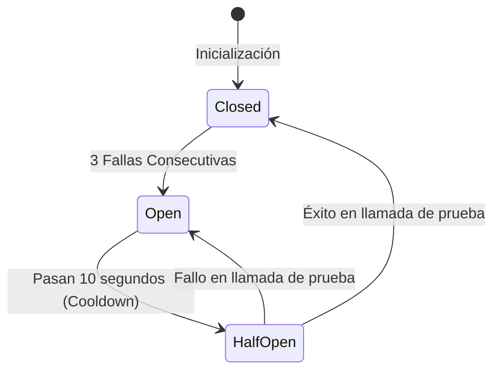

# Entrega 2: Bloque Individual de Resiliencia

---

## 1. Descripción del Bloque
El microservicio `order-service` es el componente transaccional principal del sistema **FoodRush**. Su función es gestionar el ciclo de vida de los pedidos (creación de órdenes, consulta de detalles e inicio del flujo de retiro mediante código QR). 

Dentro del ecosistema FoodRush, la creación de una orden depende críticamente del `catalog-service` para obtener el precio real y la disponibilidad vigente de cada producto. El flujo completo de punta a punta se comporta de la siguiente manera:
1. El cliente envía una petición HTTP `POST /orders` con los ítems solicitados.
2. El **API Gateway** traduce la solicitud a un llamado gRPC hacia el método `CreateOrder` en `order-service`.
3. Para cada producto en la orden, `order-service` invoca dinámicamente el endpoint gRPC `GetProductDetails` expuesto por `catalog-service`.
4. Si el catálogo responde exitosamente, se valida que el producto esté disponible y se calcula el total transaccional.
5. Finalmente, la orden se guarda en **MongoDB** en estado `"CREATED"` y se retorna la respuesta al cliente.

Debido a que `catalog-service` es un servicio externo a nivel de red para `order-service`, cualquier falla en él (caídas de su base de datos PostgreSQL, saturación de CPU o problemas de red) puede provocar fallas en cascada y bloquear el procesamiento de todas las órdenes en FoodRush. Para mitigar esto, este bloque implementa un **Circuit Breaker** (Disyuntor) concurrente y autocontenido en el cliente gRPC que conecta a `order-service` con `catalog-service`.

---

## 2. Decisiones Técnicas

### Decisión Técnica Clave
Implementar el patrón **Circuit Breaker** encapsulado en un Wrapper concurrente (`ResilientCatalogClient`) para las llamadas gRPC salientes hacia el catálogo, definiendo reglas de transiciones de estados (`Closed`, `Open`, `Half-Open`) gobernadas por contadores y tiempos de espera controlados.

*   **Umbral de fallas**: 3 errores consecutivos.
*   **Tiempo de enfriamiento (Cooldown)**: 10 segundos.
*   **Timeouts por llamada**: Contextos de Go con límite de 2 segundos.

### Alternativas Descartadas y Justificación

#### Alternativa Descartada 1: Reintentos simples e ilimitados (Retries)
*   **Razonamiento**: Si `catalog-service` se cae debido a una sobrecarga de su base de datos PostgreSQL, un mecanismo que únicamente reintente peticiones sin cesar (o con tiempos fijos cortos) agravará el problema. Este fenómeno se conoce como *Retry Storm* (Tormenta de Reintentos) y puede evitar que el servicio caído logre recuperarse. 
*   **Por qué el Circuit Breaker es mejor**: Al alcanzar el umbral de fallas (3 fallos), el Circuit Breaker corta las peticiones inmediatamente (fail-fast), aislando el servicio afectado y permitiendo su recuperación natural.

#### Alternativa Descartada 2: Caching de precios en `order-service`
*   **Razonamiento**: Almacenar en una memoria caché local los detalles de los productos para usarlos como "fallback" cuando el catálogo no esté disponible.
*   **Por qué se descartó**: Los precios de los menús y la disponibilidad de stock en delivery cambian constantemente. Usar datos obsoletos (*stale data*) podría llevar a cobrar montos incorrectos a los usuarios o a aceptar compras de productos agotados, dañando la consistencia transaccional y la experiencia del cliente. Se prioriza la **consistencia** (CP del teorema de CAP) sobre la disponibilidad de datos viejos.

---

## 3. Comportamiento ante Fallos

El Circuit Breaker gestiona activamente la degradación del servicio bajo las siguientes contingencias:

### Escenarios Específicos de Falla y Recuperación

1.  **Catalog-service caído (Falla completa)**:
    *   *Comportamiento*: Las llamadas iniciales fallarán. Al acumular la tercera falla consecutiva, el disyuntor cambia al estado `OPEN`.
    *   *Recuperación/Degradación*: Las siguientes llamadas para crear órdenes no tocarán la red. El disyuntor intercepta la petición y retorna inmediatamente el error `codes.Unavailable`. La base de datos MongoDB no se ensucia con registros corruptos o totales incompletos.
2.  **Catalog-service lento (Latencia elevada)**:
    *   *Comportamiento*: Al usar `context.WithTimeout(ctx, 2*time.Second)`, cualquier consulta que supere este límite de tiempo se cancela y se registra como un fallo de timeout.
    *   *Recuperación/Degradación*: Evita que los hilos y sockets del `order-service` se mantengan ocupados esperando una respuesta tardía, previniendo el agotamiento de recursos del sistema. El breaker se abre tras 3 timeouts.
3.  **MongoDB de órdenes caído**:
    *   *Comportamiento*: Aunque el catálogo funcione bien, si la persistencia falla, `order-service` detecta el error en la llamada al repositorio y retorna un código `codes.Internal` al API Gateway. No se simula éxito falso.
4.  **Estado Half-Open (Recuperación Proactiva)**:
    *   *Comportamiento*: Pasados los 10 segundos de cooldown en estado `OPEN`, el siguiente cliente que intente crear una orden activa una llamada de prueba en estado `HALF-OPEN`. Si el catálogo responde bien, el circuito vuelve a `CLOSED` y el sistema funciona al 100%. Si sigue fallando, vuelve a `OPEN` por otros 10 segundos.

---

## 4. Trade-offs y Limitaciones

*   **Falsos Negativos durante el Cooldown**: Cuando el Circuit Breaker se abre debido a fallos reales y el servicio de catálogo se recupera rápidamente (por ejemplo, a los 2 segundos de abrirse el breaker), cualquier orden enviada en los siguientes 8 segundos seguirá siendo rechazada automáticamente. Aceptamos este trade-off para priorizar la salud e integridad global de la arquitectura distribuidora antes de volver a arriesgar tráfico real.
*   **Estado en Memoria Local (Instance Lock)**: La máquina de estados del disyuntor se encuentra en la memoria RAM del contenedor de `order-service`. Si se despliegan múltiples réplicas (escalamiento horizontal), el estado de resiliencia no se comparte de forma nativa. Si una réplica detecta fallos y abre su circuito, las demás réplicas no lo sabrán hasta que ellas internas experimenten fallos. Se acepta esta limitación para evitar la complejidad y latencia de introducir un coordinador externo como Redis.
