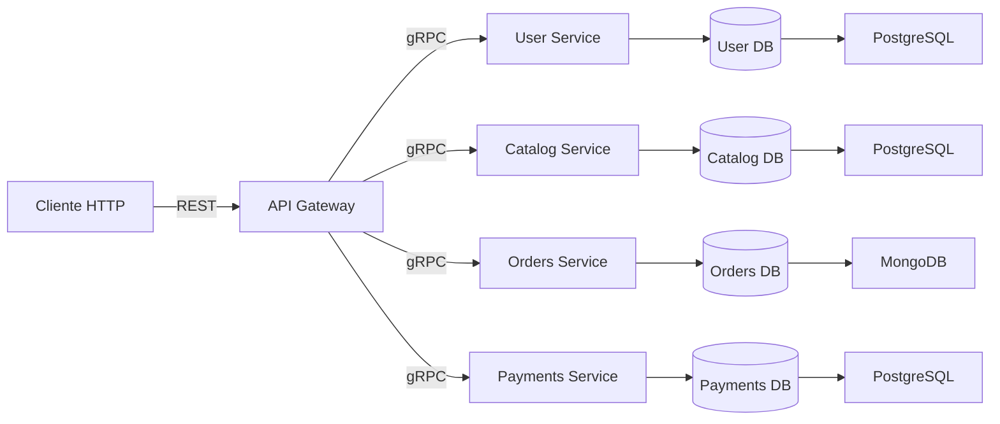
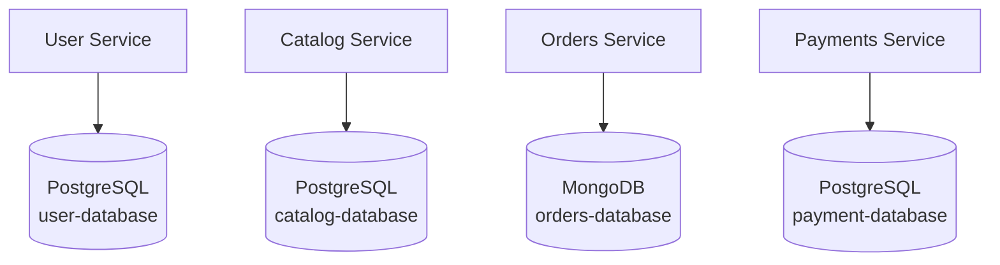

# Documento Técnico

## Descripción Del Sistema

FoodRush es un sistema distribuido orientado a la gestión de pedidos para comercios gastronómicos. Su objetivo es exponer una interfaz pública simple para consumidores finales, mientras que la lógica de negocio se descompone en servicios autónomos de usuarios, catálogo, pedidos y pagos, coordinados internamente mediante gRPC y un API Gateway HTTP.

## Arquitectura

### Persistencia Por Servicio

## Servicios Del Sistema

- `user-service`: administra el alta y la consulta del perfil de usuario.
- `catalog-service`: concentra el dominio de comercios, menús y productos.
- `orders-service`: gestiona la creación, consulta y confirmación de pedidos.
- `payments-service`: encapsula el procesamiento y la consulta del estado de pago.
- `api-gateway`: actúa como punto de entrada HTTP/REST y traduce solicitudes hacia los contratos gRPC internos.

## Red Interna

Los servicios internos no se exponen al host. La comunicación entre contenedores se realiza mediante nombres de servicio de Docker, lo que evita dependencias de IPs fijas y preserva el aislamiento de la red privada del stack.

## Acoplamiento

Cada servicio posee su propia base de datos y su propio contrato gRPC. No existen tablas compartidas, estructuras internas reutilizadas entre dominios ni acceso directo entre bases de datos. Esta decisión reduce el acoplamiento estructural y facilita la evolución independiente de cada frontera funcional.

## Justificacion De Limites

- `user-service` existe para aislar la gestión de identidad, autenticación funcional y atributos de perfil.
- `catalog-service` existe para delimitar el subdominio de oferta comercial, evitando mezclarlo con la lógica transaccional.
- `orders-service` existe para encapsular el ciclo de vida del pedido, su estado y su persistencia en una colección transaccional distinta.
- `payments-service` existe para modelar el flujo de cobro como una responsabilidad separada del pedido, reduciendo dependencia temporal y conceptual.
- `api-gateway` existe para desacoplar la interfaz pública HTTP de la comunicación interna gRPC y concentrar la traducción de protocolos en un único punto.

## Casos De Uso Y Flujos

### 1. Registrar Usuario

El cliente invoca `POST /users` con los atributos `nombre`, `correo`, `password` y `payment_token`. El gateway transforma la solicitud HTTP en la llamada gRPC `CreateUser` sobre `user-service`. Dicho servicio valida la integridad semántica de los datos y persiste el usuario en PostgreSQL. El resultado observable para el cliente es la creación de una entidad `User` con identificador persistido y estado `created`.

Flujo técnico:
- Cliente -> API Gateway por HTTP/REST
- API Gateway -> User Service por gRPC
- User Service -> PostgreSQL del dominio de usuarios
- Respuesta JSON al cliente con el recurso creado

### 2. Consultar Catálogo

El cliente consulta `GET /catalog/comercios`, `GET /catalog/comercios/{id}/menu` o `GET /catalog/products/{id}`. El gateway reenvía la operación al `catalog-service`, que resuelve la lectura desde su base de datos PostgreSQL. El resultado esperado es la lista de comercios activos, el menú asociado a un comercio o el detalle técnico de un producto.

Flujo técnico:
- Cliente -> API Gateway
- API Gateway -> Catalog Service por gRPC
- Catalog Service -> PostgreSQL del dominio de catálogo
- Respuesta JSON al cliente

### 3. Crear Pedido

El cliente envía `POST /orders` con `user_id`, `comercio_id` e `items`. El gateway delega en `orders-service` la operación `CreateOrder`. Antes de persistir, el servicio consulta a `catalog-service` por cada `producto_id` para obtener el precio vigente y calcular el importe total con datos reales del catálogo. Luego normaliza el pedido y lo persiste en MongoDB. El resultado esperado es un pedido creado con identificador propio, monto total y estado inicial de negocio.

Flujo técnico:
- Cliente -> API Gateway
- API Gateway -> Orders Service por gRPC
- Orders Service -> Catalog Service por gRPC para resolver precios
- Orders Service -> MongoDB del dominio de pedidos
- Respuesta JSON al cliente

### 4. Procesar Pago

El cliente envía `POST /payments/process` con `order_id`, `user_id`, `amount` y `metodo_pago_token`. El gateway invoca `ProcessPayment` sobre `payments-service`, que encapsula la ejecución del flujo de cobro y retorna un estado de aprobación o rechazo. El resultado esperado es un registro de pago con estado explícito.

Flujo técnico:
- Cliente -> API Gateway
- API Gateway -> Payments Service por gRPC
- Payments Service ejecuta su lógica de cobro y responde
- Respuesta JSON al cliente

## Decisiones Tecnicas Y Trade-offs

### Base De Datos Por Servicio

Se adoptó una base de datos por servicio para evitar acoplamiento de persistencia y permitir evolución independiente de cada subdominio. El beneficio principal es el aislamiento de responsabilidades, el ownership claro de los datos y la reducción del riesgo de regresiones cruzadas. El costo es operativo: se incrementa el número de contenedores, variables de entorno y puntos de observación.

### API Gateway Como Entrada Unica

Se eligió un API Gateway HTTP/REST para ofrecer una interfaz pública uniforme y mantener gRPC como contrato interno entre servicios. La ventaja es una superficie de consumo más sencilla y un punto único para políticas transversales. La desventaja es una capa adicional en la ruta de petición y un componente más a mantener.

### gRPC Interno Con Protobuf

Se adoptó gRPC con Protobuf para la comunicación interna debido a su tipado fuerte, bajo costo de serialización y generación de clientes/servidores a partir de contrato. Esto mejora la consistencia del intercambio entre servicios. A cambio, se pierde legibilidad directa frente a JSON y se introduce una etapa adicional de generación de código.

### Servicios Separados Por Dominio

La separación en usuarios, catálogo, pedidos y pagos responde a límites de negocio observables y no a una división accidental del código. Esta decisión incrementa la cohesión interna de cada servicio y reduce el riesgo de mezclar responsabilidades. El costo es una mayor coordinación entre componentes y un mayor esfuerzo inicial de integración.

En el caso de pedidos, existe una dependencia de lectura controlada hacia catálogo para resolver precios actuales. `orders-service` consulta a `catalog-service` durante `CreateOrder` para obtener el precio real de cada producto y calcular el total con datos vigentes. Esta decisión mejora la coherencia del negocio, pero introduce una dependencia temporal entre ambos servicios durante la creación de una orden.

Cuando catálogo no responde, `orders-service` reintenta la lectura unas pocas veces y devuelve un error controlado al caller en lugar de colgarse.

### Persistencia Heterogenea

Se emplea PostgreSQL para usuarios, catálogo y pagos, y MongoDB para pedidos. La elección responde a patrones de acceso distintos: consultas relacionales y consistencia estructurada en unos dominios, y documentos flexibles en el caso de pedidos. El beneficio es una representación más natural de cada entidad; el costo es la heterogeneidad tecnológica y una mayor complejidad operativa.

### Persistencia Por Dominio

- Usuarios: se persisten en PostgreSQL del `user-service`.
- Catálogo: comercios y productos se persisten en PostgreSQL del `catalog-service`.
- Pedidos: se persisten en MongoDB del `orders-service`.
- Pagos: el `payments-service` encapsula el flujo de cobro y su estado dentro de su propio contrato.
